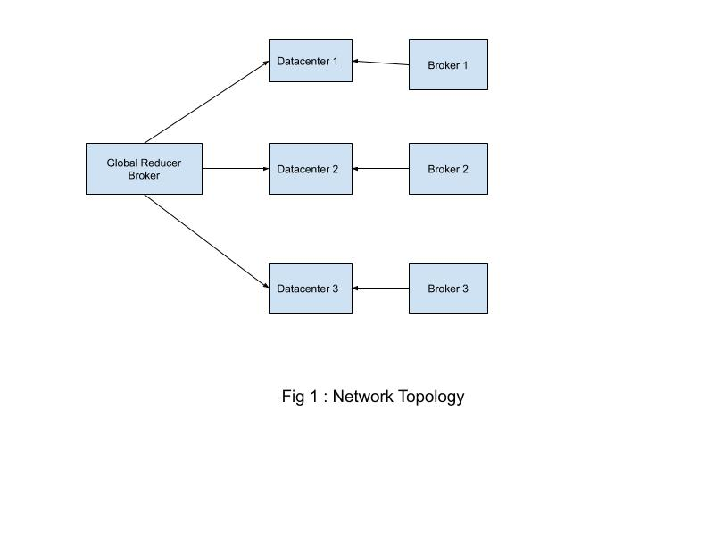

## CS 441: Engineering Distributed Objects for Cloud Computing
Homework 1: A simulation of network datacenters with a particular topology with varying VM allocation policies and cloudlet utilization models
---
Name: Abhijeet Mohanty
---


### Instructions

#### Development Environment

The assignment was developed using the following environment:

- **OS:** macOs Mojave 
- **IDE:** IntelliJ IDEA Ultimate 2018.1
- **Java version:** 1.8.121
- **Gradle version:** 4.10.2
 
#### Assembly details

- Primarily the `build.gradle` file was added to the `cloud-simulator` module where the respective dependencies are specified along with the `mainRunnerClass`.
- The I navigated to the **Project Structure** where I add `cloud-simulator` as a Gradle module and run the respective gradle commands from withing this module.


#### Running the application
- Clone the project and open it up on IntelliJ.
- Add `cloud-simulator` as a **Gradle** project by navigating to **Project Structure/Modules** in IntelliJ.
- Navigate to the module **<parent_project>/cloud-simulator**  and then execute the following command :-
    
 ```
    > gradle clean build test
 ```
    
 ```
    > gradle clean build run
 ```

- NOTE: The execution runs for around 3 to 4 minutes

### About the application

- In this application, I primarily aim to replicate a real world network of datacenter with switches (root, aggregate and edge switches) such that each 
component is mapped to a network topology with the help of a `*.brite` file. Then I proceed to run a map-reduce job to complete my simulation and record results
arising from introducing variations in VM allocation policies and cloudlet's CPU utilization models which are reported.


### Network topology

- The following topology was created with the help of `network-topology-1.brite`



- Edge switches 

     Connects all hosts of a datacenter.
    
     No. of edge switches = 25
    
     No. of ports = 5 

- Aggregate switches

     Connects all edge switches.    
     
     No. of aggregate switches = 5
     
     No. of ports = 5

- Root switches

    Connects all datacenters
    
    No. of root switches = 1
    
    No. of ports = 3

- Each simulations runs a total of 3 datacenters where each datacenter has 2 hosts.    
           

### Code flow overview

#### Code flow 

- `MapReduceJobRunner` : This is the entry point of the application which loads the `cloud-service-providers.conf` to load the 
 configuration of **datacenters** and the `map-reduce-job.conf` file which loads the config for the **map-reduce** job.
- **Factory pattern** is used to create various components in the simulation - be it switches, datacenters, hosts etc.
- `DecoratedCloudletsTableBuilder` : This class is an extension over `CloudletsTableBuilder` for displaying extra parameters
as far as execution of cloudlets is concerned.
- `NetworkDatacenterUtils` : This is a utility class to add **root switches** and map **network components** to a network topology. 


#### Map Reduce Model design

Here, my model consists of the primary components :
  
-  `Client` : This component generates a request to submit the map-reduce job. As a part of this request, the `Client` requires
  virtual machines and cloudlets for the job to be run.
  
-  `ResourceManager` : This component accepts the request from the client and generates the mappers and reducers required to complete the task with the help of
  the configuration pertaining to a map-reduce job specified in the `map-reduce-job.conf` file.
  
-  `JobTracker` : This component resolves a reducer for a given mapper and keep listening to events generates by a mapper. Upon completion of the mapper, it submits
  a request for the corresponding reducer to be run.
  
-  `Mapper` : This is the component which extends the `NetworkCloudlet` and has a one to one corresponds with that of a mapper in the map-reduce framework.
  
-  `Reducer` :  This is the component which extends the `NetworkCloudlet` and has a one to one corresponds with that of a reducer in the map-reduce framework.


### VM allocation policies compared

- Simple VM allocation policy : In this allocation policy, the hosts are allocated VMs depending on which host has the 
maximum no. of processing elements to use.
- Round robin VM allocation policy : In this allocation policy, the hosts are stored in a circular queue and the next host to be picked
up for a VM allocation depends on the last hosts' index which was allocated a VM.
- Best fit VM allocation policy : In this allocation policy, the hosts are allocated VMs depending on which host has the 
minimum no. of processing elements to use.


### Cloudlet utilization policies compared

- Full utilization : In this utilization model, a cloudlet utilizies the VM it is assigned to its fullest.
- Stochastic utilization policy : In this utilization model, a cloudlet utilizes the VM based on some randomization model.

### Statistical results

Attached below is sample of the simulation results which were obtained for simple VM allocation policy with the full utilization model.
```
                                                                                 SIMULATION RESULTS

Cloudlet|Status |DC|Host|Host PEs |VM|VM PEs   |CloudletLen|CloudletPEs|StartTime|FinishTime|ExecTime|Cloudlet Type|Accumulated Bandwidth Cost|Actual CPU time|Actual RAM utilization
      ID|       |ID|  ID|CPU cores|ID|CPU cores|         MI|  CPU cores|  Seconds|   Seconds| Seconds|             |                          |               |                      
-------------------------------------------------------------------------------------------------------------------------------------------------------------------------------------
      96|SUCCESS| 1|   0|        3| 0|        2|      10000|          1|      405|       530|     125|class com.cs441.cloudsimulator.jobs.Mapper|                       0.0|125.21999999999991|                   1.0
      98|SUCCESS| 1|   0|        3| 0|        2|      10000|          1|      405|       530|     125|class com.cs441.cloudsimulator.jobs.Mapper|                       0.0|125.21999999999991|                   1.0
     100|SUCCESS| 1|   0|        3| 0|        2|      10000|          1|      405|       530|     125|class com.cs441.cloudsimulator.jobs.Mapper|                       0.0|125.21999999999991|                   1.0
     102|SUCCESS| 1|   0|        3| 0|        2|      10000|          1|      405|       530|     125|class com.cs441.cloudsimulator.jobs.Mapper|                       0.0|125.21999999999991|                   1.0
     104|SUCCESS| 1|   0|        3| 0|        2|      10000|          1|      405|       530|     125|class com.cs441.cloudsimulator.jobs.Mapper|                       0.0|125.21999999999991|                   1.0
     106|SUCCESS| 1|   0|        3| 0|        2|      10000|          1|      405|       530|     125|class com.cs441.cloudsimulator.jobs.Mapper|                       0.0|125.21999999999991|                   1.0
     108|SUCCESS| 1|   0|        3| 0|        2|      10000|          1|      405|       530|     125|class com.cs441.cloudsimulator.jobs.Mapper|                       0.0|125.21999999999991|                   1.0
     110|SUCCESS| 1|   0|        3| 0|        2|      10000|          1|      405|       530|     125|class com.cs441.cloudsimulator.jobs.Mapper|                       0.0|125.21999999999991|                   1.0
     112|SUCCESS| 1|   0|        3| 0|        2|      10000|          1|      405|       530|     125|class com.cs441.cloudsimulator.jobs.Mapper|                       0.0|125.21999999999991|                   1.0
     114|SUCCESS| 1|   0|        3| 0|        2|      10000|          1|      405|       530|     125|class com.cs441.cloudsimulator.jobs.Mapper|                       0.0|125.21999999999991|                   1.0
     116|SUCCESS| 1|   0|        3| 0|        2|      10000|          1|      405|       530|     125|class com.cs441.cloudsimulator.jobs.Mapper|                       0.0|125.21999999999991|                   1.0
     118|SUCCESS| 1|   0|        3| 0|        2|      10000|          1|      405|       530|     125|class com.cs441.cloudsimulator.jobs.Mapper|                       0.0|125.21999999999991|                   1.0
     120|SUCCESS| 1|   0|        3| 0|        2|      10000|          1|      405|       530|     125|class com.cs441.cloudsimulator.jobs.Mapper|                       0.0|125.21999999999991|                   1.0
     122|SUCCESS| 1|   0|        3| 0|        2|      10000|          1|      405|       530|     125|class com.cs441.cloudsimulator.jobs.Mapper|                       0.0|125.21999999999991|                   1.0
     124|SUCCESS| 1|   0|        3| 0|        2|      10000|          1|      405|       530|     125|class com.cs441.cloudsimulator.jobs.Mapper|                       0.0|125.21999999999991|                   1.0
     126|SUCCESS| 1|   0|        3| 0|        2|      10000|          1|      405|       530|     125|class com.cs441.cloudsimulator.jobs.Mapper|                       0.0|125.21999999999991|                   1.0
     128|SUCCESS| 1|   0|        3| 0|        2|      10000|          1|      405|       530|     125|class com.cs441.cloudsimulator.jobs.Mapper|                       0.0|125.21999999999991|                   1.0
     130|SUCCESS| 1|   0|        3| 0|        2|      10000|          1|      405|       530|     125|class com.cs441.cloudsimulator.jobs.Mapper|                       0.0|125.21999999999991|                   1.0
     132|SUCCESS| 1|   0|        3| 0|        2|      10000|          1|      405|       530|     125|class com.cs441.cloudsimulator.jobs.Mapper|                       0.0|125.21999999999991|                   1.0
     134|SUCCESS| 1|   0|        3| 0|        2|      10000|          1|      405|       530|     125|class com.cs441.cloudsimulator.jobs.Mapper|                       0.0|125.21999999999991|                   1.0
     136|SUCCESS| 1|   0|        3| 0|        2|      10000|          1|      405|       530|     125|class com.cs441.cloudsimulator.jobs.Mapper|                       0.0|125.21999999999991|                   1.0
     138|SUCCESS| 1|   0|        3| 0|        2|      10000|          1|      405|       530|     125|class com.cs441.cloudsimulator.jobs.Mapper|                       0.0|125.21999999999991|                   1.0
     140|SUCCESS| 1|   0|        3| 0|        2|      10000|          1|      405|       530|     125|class com.cs441.cloudsimulator.jobs.Mapper|                       0.0|125.21999999999991|                   1.0
     142|SUCCESS| 1|   0|        3| 0|        2|      10000|          1|      405|       530|     125|class com.cs441.cloudsimulator.jobs.Mapper|                       0.0|125.21999999999991|                   1.0
     144|SUCCESS| 1|   0|        3| 0|        2|      10000|          1|      405|       530|     125|class com.cs441.cloudsimulator.jobs.Mapper|                       0.0|125.21999999999991|                   1.0
      97|SUCCESS| 1|   1|        3| 1|        2|      10000|          1|      405|       530|     125|class com.cs441.cloudsimulator.jobs.Mapper|                       0.0|125.21999999999991|                   1.0
      99|SUCCESS| 1|   1|        3| 1|        2|      10000|          1|      405|       530|     125|class com.cs441.cloudsimulator.jobs.Mapper|                       0.0|125.21999999999991|                   1.0
     101|SUCCESS| 1|   1|        3| 1|        2|      10000|          1|      405|       530|     125|class com.cs441.cloudsimulator.jobs.Mapper|                       0.0|125.21999999999991|                   1.0
     103|SUCCESS| 1|   1|        3| 1|        2|      10000|          1|      405|       530|     125|class com.cs441.cloudsimulator.jobs.Mapper|                       0.0|125.21999999999991|                   1.0
     105|SUCCESS| 1|   1|        3| 1|        2|      10000|          1|      405|       530|     125|class com.cs441.cloudsimulator.jobs.Mapper|                       0.0|125.21999999999991|                   1.0
     107|SUCCESS| 1|   1|        3| 1|        2|      10000|          1|      405|       530|     125|class com.cs441.cloudsimulator.jobs.Mapper|                       0.0|125.21999999999991|                   1.0
     109|SUCCESS| 1|   1|        3| 1|        2|      10000|          1|      405|       530|     125|class com.cs441.cloudsimulator.jobs.Mapper|                       0.0|125.21999999999991|                   1.0
     111|SUCCESS| 1|   1|        3| 1|        2|      10000|          1|      405|       530|     125|class com.cs441.cloudsimulator.jobs.Mapper|                       0.0|125.21999999999991|                   1.0
     113|SUCCESS| 1|   1|        3| 1|        2|      10000|          1|      405|       530|     125|class com.cs441.cloudsimulator.jobs.Mapper|                       0.0|125.21999999999991|                   1.0
     115|SUCCESS| 1|   1|        3| 1|        2|      10000|          1|      405|       530|     125|class com.cs441.cloudsimulator.jobs.Mapper|                       0.0|125.21999999999991|                   1.0
     117|SUCCESS| 1|   1|        3| 1|        2|      10000|          1|      405|       530|     125|class com.cs441.cloudsimulator.jobs.Mapper|                       0.0|125.21999999999991|                   1.0
     119|SUCCESS| 1|   1|        3| 1|        2|      10000|          1|      405|       530|     125|class com.cs441.cloudsimulator.jobs.Mapper|                       0.0|125.21999999999991|                   1.0
     121|SUCCESS| 1|   1|        3| 1|        2|      10000|          1|      405|       530|     125|class com.cs441.cloudsimulator.jobs.Mapper|                       0.0|125.21999999999991|                   1.0
     123|SUCCESS| 1|   1|        3| 1|        2|      10000|          1|      405|       530|     125|class com.cs441.cloudsimulator.jobs.Mapper|                       0.0|125.21999999999991|                   1.0
     125|SUCCESS| 1|   1|        3| 1|        2|      10000|          1|      405|       530|     125|class com.cs441.cloudsimulator.jobs.Mapper|                       0.0|125.21999999999991|                   1.0
     127|SUCCESS| 1|   1|        3| 1|        2|      10000|          1|      405|       530|     125|class com.cs441.cloudsimulator.jobs.Mapper|                       0.0|125.21999999999991|                   1.0
     129|SUCCESS| 1|   1|        3| 1|        2|      10000|          1|      405|       530|     125|class com.cs441.cloudsimulator.jobs.Mapper|                       0.0|125.21999999999991|                   1.0
     131|SUCCESS| 1|   1|        3| 1|        2|      10000|          1|      405|       530|     125|class com.cs441.cloudsimulator.jobs.Mapper|                       0.0|125.21999999999991|                   1.0
     133|SUCCESS| 1|   1|        3| 1|        2|      10000|          1|      405|       530|     125|class com.cs441.cloudsimulator.jobs.Mapper|                       0.0|125.21999999999991|                   1.0
     135|SUCCESS| 1|   1|        3| 1|        2|      10000|          1|      405|       530|     125|class com.cs441.cloudsimulator.jobs.Mapper|                       0.0|125.21999999999991|                   1.0
     137|SUCCESS| 1|   1|        3| 1|        2|      10000|          1|      405|       530|     125|class com.cs441.cloudsimulator.jobs.Mapper|                       0.0|125.21999999999991|                   1.0
     139|SUCCESS| 1|   1|        3| 1|        2|      10000|          1|      405|       530|     125|class com.cs441.cloudsimulator.jobs.Mapper|                       0.0|125.21999999999991|                   1.0
     141|SUCCESS| 1|   1|        3| 1|        2|      10000|          1|      405|       530|     125|class com.cs441.cloudsimulator.jobs.Mapper|                       0.0|125.21999999999991|                   1.0
     143|SUCCESS| 1|   1|        3| 1|        2|      10000|          1|      405|       530|     125|class com.cs441.cloudsimulator.jobs.Mapper|                       0.0|125.21999999999991|                   1.0
     145|SUCCESS| 1|   1|        3| 1|        2|      10000|          1|      405|       530|     125|class com.cs441.cloudsimulator.jobs.Mapper|                       0.0|125.21999999999991|                   1.0
-------------------------------------------------------------------------------------------------------------------------------------------------------------------------------------
```


```
                                                                                 SIMULATION RESULTS

Cloudlet|Status |DC|Host|Host PEs |VM|VM PEs   |CloudletLen|CloudletPEs|StartTime|FinishTime|ExecTime|Cloudlet Type|Accumulated Bandwidth Cost|Actual CPU time|Actual RAM utilization
      ID|       |ID|  ID|CPU cores|ID|CPU cores|         MI|  CPU cores|  Seconds|   Seconds| Seconds|             |                          |               |                      
-------------------------------------------------------------------------------------------------------------------------------------------------------------------------------------
      64|SUCCESS|33|   0|        3| 0|        2|      20000|          1|      783|      1783|    1000|class com.cs441.cloudsimulator.jobs.Reducer|                       0.0|1000.3699999999994|                   1.0
      66|SUCCESS|33|   0|        3| 0|        2|      20000|          1|      783|      1783|    1000|class com.cs441.cloudsimulator.jobs.Reducer|                       0.0|1000.3699999999994|                   1.0
      68|SUCCESS|33|   0|        3| 0|        2|      20000|          1|      783|      1783|    1000|class com.cs441.cloudsimulator.jobs.Reducer|                       0.0|1000.3699999999994|                   1.0
      70|SUCCESS|33|   0|        3| 0|        2|      20000|          1|      783|      1783|    1000|class com.cs441.cloudsimulator.jobs.Reducer|                       0.0|1000.3699999999994|                   1.0
      72|SUCCESS|33|   0|        3| 0|        2|      20000|          1|      783|      1783|    1000|class com.cs441.cloudsimulator.jobs.Reducer|                       0.0|1000.3699999999994|                   1.0
      74|SUCCESS|33|   0|        3| 0|        2|      20000|          1|      783|      1783|    1000|class com.cs441.cloudsimulator.jobs.Reducer|                       0.0|1000.3699999999994|                   1.0
      76|SUCCESS|33|   0|        3| 0|        2|      20000|          1|      783|      1783|    1000|class com.cs441.cloudsimulator.jobs.Reducer|                       0.0|1000.3699999999994|                   1.0
      78|SUCCESS|33|   0|        3| 0|        2|      20000|          1|      783|      1783|    1000|class com.cs441.cloudsimulator.jobs.Reducer|                       0.0|1000.3699999999994|                   1.0
      80|SUCCESS|33|   0|        3| 0|        2|      20000|          1|      783|      1783|    1000|class com.cs441.cloudsimulator.jobs.Reducer|                       0.0|1000.3699999999994|                   1.0
      82|SUCCESS|33|   0|        3| 0|        2|      20000|          1|      783|      1783|    1000|class com.cs441.cloudsimulator.jobs.Reducer|                       0.0|1000.3699999999994|                   1.0
      84|SUCCESS|33|   0|        3| 0|        2|      20000|          1|      783|      1783|    1000|class com.cs441.cloudsimulator.jobs.Reducer|                       0.0|1000.3699999999994|                   1.0
      86|SUCCESS|33|   0|        3| 0|        2|      20000|          1|      783|      1783|    1000|class com.cs441.cloudsimulator.jobs.Reducer|                       0.0|1000.3699999999994|                   1.0
      88|SUCCESS|33|   0|        3| 0|        2|      20000|          1|      783|      1783|    1000|class com.cs441.cloudsimulator.jobs.Reducer|                       0.0|1000.3699999999994|                   1.0
      90|SUCCESS|33|   0|        3| 0|        2|      20000|          1|      783|      1783|    1000|class com.cs441.cloudsimulator.jobs.Reducer|                       0.0|1000.3699999999994|                   1.0
      92|SUCCESS|33|   0|        3| 0|        2|      20000|          1|      783|      1783|    1000|class com.cs441.cloudsimulator.jobs.Reducer|                       0.0|1000.3699999999994|                   1.0
      94|SUCCESS|33|   0|        3| 0|        2|      20000|          1|      783|      1783|    1000|class com.cs441.cloudsimulator.jobs.Reducer|                       0.0|1000.3699999999994|                   1.0
      96|SUCCESS|33|   0|        3| 0|        2|      20000|          1|      783|      1783|    1000|class com.cs441.cloudsimulator.jobs.Reducer|                       0.0|1000.3699999999994|                   1.0
      98|SUCCESS|33|   0|        3| 0|        2|      20000|          1|      783|      1783|    1000|class com.cs441.cloudsimulator.jobs.Reducer|                       0.0|1000.3699999999994|                   1.0
     100|SUCCESS|33|   0|        3| 0|        2|      20000|          1|      783|      1783|    1000|class com.cs441.cloudsimulator.jobs.Reducer|                       0.0|1000.3699999999994|                   1.0
     102|SUCCESS|33|   0|        3| 0|        2|      20000|          1|      783|      1783|    1000|class com.cs441.cloudsimulator.jobs.Reducer|                       0.0|1000.3699999999994|                   1.0
     104|SUCCESS|33|   0|        3| 0|        2|      20000|          1|      783|      1783|    1000|class com.cs441.cloudsimulator.jobs.Reducer|                       0.0|1000.3699999999994|                   1.0
     106|SUCCESS|33|   0|        3| 0|        2|      20000|          1|      783|      1783|    1000|class com.cs441.cloudsimulator.jobs.Reducer|                       0.0|1000.3699999999994|                   1.0
     108|SUCCESS|33|   0|        3| 0|        2|      20000|          1|      783|      1783|    1000|class com.cs441.cloudsimulator.jobs.Reducer|                       0.0|1000.3699999999994|                   1.0
     110|SUCCESS|33|   0|        3| 0|        2|      20000|          1|      783|      1783|    1000|class com.cs441.cloudsimulator.jobs.Reducer|                       0.0|1000.3699999999994|                   1.0
     112|SUCCESS|33|   0|        3| 0|        2|      20000|          1|      783|      1783|    1000|class com.cs441.cloudsimulator.jobs.Reducer|                       0.0|1000.3699999999994|                   1.0
      65|SUCCESS|33|   0|        3| 0|        2|      20000|          1|      783|      1783|    1000|class com.cs441.cloudsimulator.jobs.Reducer|                       0.0|1000.3699999999994|                   1.0
      67|SUCCESS|33|   0|        3| 0|        2|      20000|          1|      783|      1783|    1000|class com.cs441.cloudsimulator.jobs.Reducer|                       0.0|1000.3699999999994|                   1.0
      69|SUCCESS|33|   0|        3| 0|        2|      20000|          1|      783|      1783|    1000|class com.cs441.cloudsimulator.jobs.Reducer|                       0.0|1000.3699999999994|                   1.0
      71|SUCCESS|33|   0|        3| 0|        2|      20000|          1|      783|      1783|    1000|class com.cs441.cloudsimulator.jobs.Reducer|                       0.0|1000.3699999999994|                   1.0
      73|SUCCESS|33|   0|        3| 0|        2|      20000|          1|      783|      1783|    1000|class com.cs441.cloudsimulator.jobs.Reducer|                       0.0|1000.3699999999994|                   1.0
      75|SUCCESS|33|   0|        3| 0|        2|      20000|          1|      783|      1783|    1000|class com.cs441.cloudsimulator.jobs.Reducer|                       0.0|1000.3699999999994|                   1.0
      77|SUCCESS|33|   0|        3| 0|        2|      20000|          1|      783|      1783|    1000|class com.cs441.cloudsimulator.jobs.Reducer|                       0.0|1000.3699999999994|                   1.0
      79|SUCCESS|33|   0|        3| 0|        2|      20000|          1|      783|      1783|    1000|class com.cs441.cloudsimulator.jobs.Reducer|                       0.0|1000.3699999999994|                   1.0
      81|SUCCESS|33|   0|        3| 0|        2|      20000|          1|      783|      1783|    1000|class com.cs441.cloudsimulator.jobs.Reducer|                       0.0|1000.3699999999994|                   1.0
      83|SUCCESS|33|   0|        3| 0|        2|      20000|          1|      783|      1783|    1000|class com.cs441.cloudsimulator.jobs.Reducer|                       0.0|1000.3699999999994|                   1.0
      85|SUCCESS|33|   0|        3| 0|        2|      20000|          1|      783|      1783|    1000|class com.cs441.cloudsimulator.jobs.Reducer|                       0.0|1000.3699999999994|                   1.0
      87|SUCCESS|33|   0|        3| 0|        2|      20000|          1|      783|      1783|    1000|class com.cs441.cloudsimulator.jobs.Reducer|                       0.0|1000.3699999999994|                   1.0
      89|SUCCESS|33|   0|        3| 0|        2|      20000|          1|      783|      1783|    1000|class com.cs441.cloudsimulator.jobs.Reducer|                       0.0|1000.3699999999994|                   1.0
      91|SUCCESS|33|   0|        3| 0|        2|      20000|          1|      783|      1783|    1000|class com.cs441.cloudsimulator.jobs.Reducer|                       0.0|1000.3699999999994|                   1.0
      93|SUCCESS|33|   0|        3| 0|        2|      20000|          1|      783|      1783|    1000|class com.cs441.cloudsimulator.jobs.Reducer|                       0.0|1000.3699999999994|                   1.0
      95|SUCCESS|33|   0|        3| 0|        2|      20000|          1|      783|      1783|    1000|class com.cs441.cloudsimulator.jobs.Reducer|                       0.0|1000.3699999999994|                   1.0
      97|SUCCESS|33|   0|        3| 0|        2|      20000|          1|      783|      1783|    1000|class com.cs441.cloudsimulator.jobs.Reducer|                       0.0|1000.3699999999994|                   1.0
      99|SUCCESS|33|   0|        3| 0|        2|      20000|          1|      783|      1783|    1000|class com.cs441.cloudsimulator.jobs.Reducer|                       0.0|1000.3699999999994|                   1.0
     101|SUCCESS|33|   0|        3| 0|        2|      20000|          1|      783|      1783|    1000|class com.cs441.cloudsimulator.jobs.Reducer|                       0.0|1000.3699999999994|                   1.0
     103|SUCCESS|33|   0|        3| 0|        2|      20000|          1|      783|      1783|    1000|class com.cs441.cloudsimulator.jobs.Reducer|                       0.0|1000.3699999999994|                   1.0
     105|SUCCESS|33|   0|        3| 0|        2|      20000|          1|      783|      1783|    1000|class com.cs441.cloudsimulator.jobs.Reducer|                       0.0|1000.3699999999994|                   1.0
     107|SUCCESS|33|   0|        3| 0|        2|      20000|          1|      783|      1783|    1000|class com.cs441.cloudsimulator.jobs.Reducer|                       0.0|1000.3699999999994|                   1.0
     109|SUCCESS|33|   0|        3| 0|        2|      20000|          1|      783|      1783|    1000|class com.cs441.cloudsimulator.jobs.Reducer|                       0.0|1000.3699999999994|                   1.0
     111|SUCCESS|33|   0|        3| 0|        2|      20000|          1|      783|      1783|    1000|class com.cs441.cloudsimulator.jobs.Reducer|                       0.0|1000.3699999999994|                   1.0
     113|SUCCESS|33|   0|        3| 0|        2|      20000|          1|      783|      1783|    1000|class com.cs441.cloudsimulator.jobs.Reducer|                       0.0|1000.3699999999994|                   1.0
      96|SUCCESS|33|   0|        3| 0|        2|      20000|          1|      783|      1783|    1000|class com.cs441.cloudsimulator.jobs.Reducer|                       0.0|1000.3699999999994|                   1.0
      98|SUCCESS|33|   0|        3| 0|        2|      20000|          1|      783|      1783|    1000|class com.cs441.cloudsimulator.jobs.Reducer|                       0.0|1000.3699999999994|                   1.0
     100|SUCCESS|33|   0|        3| 0|        2|      20000|          1|      783|      1783|    1000|class com.cs441.cloudsimulator.jobs.Reducer|                       0.0|1000.3699999999994|                   1.0
     102|SUCCESS|33|   0|        3| 0|        2|      20000|          1|      783|      1783|    1000|class com.cs441.cloudsimulator.jobs.Reducer|                       0.0|1000.3699999999994|                   1.0
     104|SUCCESS|33|   0|        3| 0|        2|      20000|          1|      783|      1783|    1000|class com.cs441.cloudsimulator.jobs.Reducer|                       0.0|1000.3699999999994|                   1.0
     106|SUCCESS|33|   0|        3| 0|        2|      20000|          1|      783|      1783|    1000|class com.cs441.cloudsimulator.jobs.Reducer|                       0.0|1000.3699999999994|                   1.0
     108|SUCCESS|33|   0|        3| 0|        2|      20000|          1|      783|      1783|    1000|class com.cs441.cloudsimulator.jobs.Reducer|                       0.0|1000.3699999999994|                   1.0
     110|SUCCESS|33|   0|        3| 0|        2|      20000|          1|      783|      1783|    1000|class com.cs441.cloudsimulator.jobs.Reducer|                       0.0|1000.3699999999994|                   1.0
     112|SUCCESS|33|   0|        3| 0|        2|      20000|          1|      783|      1783|    1000|class com.cs441.cloudsimulator.jobs.Reducer|                       0.0|1000.3699999999994|                   1.0
     114|SUCCESS|33|   0|        3| 0|        2|      20000|          1|      783|      1783|    1000|class com.cs441.cloudsimulator.jobs.Reducer|                       0.0|1000.3699999999994|                   1.0
     116|SUCCESS|33|   0|        3| 0|        2|      20000|          1|      783|      1783|    1000|class com.cs441.cloudsimulator.jobs.Reducer|                       0.0|1000.3699999999994|                   1.0
     118|SUCCESS|33|   0|        3| 0|        2|      20000|          1|      783|      1783|    1000|class com.cs441.cloudsimulator.jobs.Reducer|                       0.0|1000.3699999999994|                   1.0
     120|SUCCESS|33|   0|        3| 0|        2|      20000|          1|      783|      1783|    1000|class com.cs441.cloudsimulator.jobs.Reducer|                       0.0|1000.3699999999994|                   1.0
     122|SUCCESS|33|   0|        3| 0|        2|      20000|          1|      783|      1783|    1000|class com.cs441.cloudsimulator.jobs.Reducer|                       0.0|1000.3699999999994|                   1.0
     124|SUCCESS|33|   0|        3| 0|        2|      20000|          1|      783|      1783|    1000|class com.cs441.cloudsimulator.jobs.Reducer|                       0.0|1000.3699999999994|                   1.0
     126|SUCCESS|33|   0|        3| 0|        2|      20000|          1|      783|      1783|    1000|class com.cs441.cloudsimulator.jobs.Reducer|                       0.0|1000.3699999999994|                   1.0
     128|SUCCESS|33|   0|        3| 0|        2|      20000|          1|      783|      1783|    1000|class com.cs441.cloudsimulator.jobs.Reducer|                       0.0|1000.3699999999994|                   1.0
     130|SUCCESS|33|   0|        3| 0|        2|      20000|          1|      783|      1783|    1000|class com.cs441.cloudsimulator.jobs.Reducer|                       0.0|1000.3699999999994|                   1.0
     132|SUCCESS|33|   0|        3| 0|        2|      20000|          1|      783|      1783|    1000|class com.cs441.cloudsimulator.jobs.Reducer|                       0.0|1000.3699999999994|                   1.0
     134|SUCCESS|33|   0|        3| 0|        2|      20000|          1|      783|      1783|    1000|class com.cs441.cloudsimulator.jobs.Reducer|                       0.0|1000.3699999999994|                   1.0
     136|SUCCESS|33|   0|        3| 0|        2|      20000|          1|      783|      1783|    1000|class com.cs441.cloudsimulator.jobs.Reducer|                       0.0|1000.3699999999994|                   1.0
     138|SUCCESS|33|   0|        3| 0|        2|      20000|          1|      783|      1783|    1000|class com.cs441.cloudsimulator.jobs.Reducer|                       0.0|1000.3699999999994|                   1.0
     140|SUCCESS|33|   0|        3| 0|        2|      20000|          1|      783|      1783|    1000|class com.cs441.cloudsimulator.jobs.Reducer|                       0.0|1000.3699999999994|                   1.0
     142|SUCCESS|33|   0|        3| 0|        2|      20000|          1|      783|      1783|    1000|class com.cs441.cloudsimulator.jobs.Reducer|                       0.0|1000.3699999999994|                   1.0
     144|SUCCESS|33|   0|        3| 0|        2|      20000|          1|      783|      1783|    1000|class com.cs441.cloudsimulator.jobs.Reducer|                       0.0|1000.3699999999994|                   1.0
      97|SUCCESS|33|   0|        3| 0|        2|      20000|          1|      783|      1783|    1000|class com.cs441.cloudsimulator.jobs.Reducer|                       0.0|1000.3699999999994|                   1.0
      99|SUCCESS|33|   0|        3| 0|        2|      20000|          1|      783|      1783|    1000|class com.cs441.cloudsimulator.jobs.Reducer|                       0.0|1000.3699999999994|                   1.0
     101|SUCCESS|33|   0|        3| 0|        2|      20000|          1|      783|      1783|    1000|class com.cs441.cloudsimulator.jobs.Reducer|                       0.0|1000.3699999999994|                   1.0
     103|SUCCESS|33|   0|        3| 0|        2|      20000|          1|      783|      1783|    1000|class com.cs441.cloudsimulator.jobs.Reducer|                       0.0|1000.3699999999994|                   1.0
     105|SUCCESS|33|   0|        3| 0|        2|      20000|          1|      783|      1783|    1000|class com.cs441.cloudsimulator.jobs.Reducer|                       0.0|1000.3699999999994|                   1.0
     107|SUCCESS|33|   0|        3| 0|        2|      20000|          1|      783|      1783|    1000|class com.cs441.cloudsimulator.jobs.Reducer|                       0.0|1000.3699999999994|                   1.0
     109|SUCCESS|33|   0|        3| 0|        2|      20000|          1|      783|      1783|    1000|class com.cs441.cloudsimulator.jobs.Reducer|                       0.0|1000.3699999999994|                   1.0
     111|SUCCESS|33|   0|        3| 0|        2|      20000|          1|      783|      1783|    1000|class com.cs441.cloudsimulator.jobs.Reducer|                       0.0|1000.3699999999994|                   1.0
     113|SUCCESS|33|   0|        3| 0|        2|      20000|          1|      783|      1783|    1000|class com.cs441.cloudsimulator.jobs.Reducer|                       0.0|1000.3699999999994|                   1.0
     115|SUCCESS|33|   0|        3| 0|        2|      20000|          1|      783|      1783|    1000|class com.cs441.cloudsimulator.jobs.Reducer|                       0.0|1000.3699999999994|                   1.0
     117|SUCCESS|33|   0|        3| 0|        2|      20000|          1|      783|      1783|    1000|class com.cs441.cloudsimulator.jobs.Reducer|                       0.0|1000.3699999999994|                   1.0
     119|SUCCESS|33|   0|        3| 0|        2|      20000|          1|      783|      1783|    1000|class com.cs441.cloudsimulator.jobs.Reducer|                       0.0|1000.3699999999994|                   1.0
     121|SUCCESS|33|   0|        3| 0|        2|      20000|          1|      783|      1783|    1000|class com.cs441.cloudsimulator.jobs.Reducer|                       0.0|1000.3699999999994|                   1.0
     123|SUCCESS|33|   0|        3| 0|        2|      20000|          1|      783|      1783|    1000|class com.cs441.cloudsimulator.jobs.Reducer|                       0.0|1000.3699999999994|                   1.0
     125|SUCCESS|33|   0|        3| 0|        2|      20000|          1|      783|      1783|    1000|class com.cs441.cloudsimulator.jobs.Reducer|                       0.0|1000.3699999999994|                   1.0
     127|SUCCESS|33|   0|        3| 0|        2|      20000|          1|      783|      1783|    1000|class com.cs441.cloudsimulator.jobs.Reducer|                       0.0|1000.3699999999994|                   1.0
     129|SUCCESS|33|   0|        3| 0|        2|      20000|          1|      783|      1783|    1000|class com.cs441.cloudsimulator.jobs.Reducer|                       0.0|1000.3699999999994|                   1.0
     131|SUCCESS|33|   0|        3| 0|        2|      20000|          1|      783|      1783|    1000|class com.cs441.cloudsimulator.jobs.Reducer|                       0.0|1000.3699999999994|                   1.0
     133|SUCCESS|33|   0|        3| 0|        2|      20000|          1|      783|      1783|    1000|class com.cs441.cloudsimulator.jobs.Reducer|                       0.0|1000.3699999999994|                   1.0
     135|SUCCESS|33|   0|        3| 0|        2|      20000|          1|      783|      1783|    1000|class com.cs441.cloudsimulator.jobs.Reducer|                       0.0|1000.3699999999994|                   1.0
     137|SUCCESS|33|   0|        3| 0|        2|      20000|          1|      783|      1783|    1000|class com.cs441.cloudsimulator.jobs.Reducer|                       0.0|1000.3699999999994|                   1.0
     139|SUCCESS|33|   0|        3| 0|        2|      20000|          1|      783|      1783|    1000|class com.cs441.cloudsimulator.jobs.Reducer|                       0.0|1000.3699999999994|                   1.0
     141|SUCCESS|33|   0|        3| 0|        2|      20000|          1|      783|      1783|    1000|class com.cs441.cloudsimulator.jobs.Reducer|                       0.0|1000.3699999999994|                   1.0
     143|SUCCESS|33|   0|        3| 0|        2|      20000|          1|      783|      1783|    1000|class com.cs441.cloudsimulator.jobs.Reducer|                       0.0|1000.3699999999994|                   1.0
     145|SUCCESS|33|   0|        3| 0|        2|      20000|          1|      783|      1783|    1000|class com.cs441.cloudsimulator.jobs.Reducer|                       0.0|1000.3699999999994|                   1.0
-------------------------------------------------------------------------------------------------------------------------------------------------------------------------------------

```

- Simulation results for reducers using a stochastic utilization model.

```
                                                                                 SIMULATION RESULTS

Cloudlet|Status |DC|Host|Host PEs |VM|VM PEs   |CloudletLen|CloudletPEs|StartTime|FinishTime|ExecTime|Cloudlet Type|Accumulated Bandwidth Cost|Actual CPU time|Actual RAM utilization
      ID|       |ID|  ID|CPU cores|ID|CPU cores|         MI|  CPU cores|  Seconds|   Seconds| Seconds|             |                          |               |                      
-------------------------------------------------------------------------------------------------------------------------------------------------------------------------------------
      71|SUCCESS|33|   0|        3| 0|        2|      20000|          1|      811|      1980|    1168|class com.cs441.cloudsimulator.jobs.Reducer|                       0.0|1168.5534186780778|    0.4452380074323963
     105|SUCCESS|33|   0|        3| 0|        2|      20000|          1|      811|      2089|    1278|class com.cs441.cloudsimulator.jobs.Reducer|                       0.0|1277.839781164984|    0.6336351422814286
     117|SUCCESS|33|   0|        3| 0|        2|      20000|          1|      811|      2150|    1338|class com.cs441.cloudsimulator.jobs.Reducer|                       0.0|1338.517347919679|    0.6148006206881336
     127|SUCCESS|33|   0|        3| 0|        2|      20000|          1|      811|      2212|    1401|class com.cs441.cloudsimulator.jobs.Reducer|                       0.0|1400.9096203570882|    0.9365813376174545
      81|SUCCESS|33|   0|        3| 0|        2|      20000|          1|      811|      2266|    1455|class com.cs441.cloudsimulator.jobs.Reducer|                       0.0|1455.4696203571514|    0.8983817786953772
      67|SUCCESS|33|   0|        3| 0|        2|      20000|          1|      811|      2425|    1614|class com.cs441.cloudsimulator.jobs.Reducer|                       0.0|1613.7734625139403|   0.14171053808830414
      87|SUCCESS|33|   0|        3| 0|        2|      20000|          1|      811|      2430|    1618|class com.cs441.cloudsimulator.jobs.Reducer|                       0.0|1618.5034625139458|    0.9359287119709014
     115|SUCCESS|33|   0|        3| 0|        2|      20000|          1|      811|      2433|    1622|class com.cs441.cloudsimulator.jobs.Reducer|                       0.0|1622.2434625139501|    0.7186736193126213
      80|SUCCESS|33|   0|        3| 0|        2|      20000|          1|      811|      2444|    1633|class com.cs441.cloudsimulator.jobs.Reducer|                       0.0|1632.8034625139624|    0.7420910805568102
      88|SUCCESS|33|   0|        3| 0|        2|      20000|          1|      811|      2458|    1647|class com.cs441.cloudsimulator.jobs.Reducer|                       0.0|1646.7734625139785|   0.11357988971248556
     106|SUCCESS|33|   0|        3| 0|        2|      20000|          1|      811|      2524|    1713|class com.cs441.cloudsimulator.jobs.Reducer|                       0.0|1712.773462514055|    0.6319947741240197
      96|SUCCESS|33|   0|        3| 0|        2|      20000|          1|      811|      2528|    1717|class com.cs441.cloudsimulator.jobs.Reducer|                       0.0|1716.8434625140596|    0.4374836130449995
      99|SUCCESS|33|   0|        3| 0|        2|      20000|          1|      811|      2556|    1745|class com.cs441.cloudsimulator.jobs.Reducer|                       0.0|1745.4434625140927|    0.7098893813143772
      85|SUCCESS|33|   0|        3| 0|        2|      20000|          1|      811|      2558|    1747|class com.cs441.cloudsimulator.jobs.Reducer|                       0.0|1746.8734625140944|   0.08444567725800423
     123|SUCCESS|33|   0|        3| 0|        2|      20000|          1|      811|      2580|    1769|class com.cs441.cloudsimulator.jobs.Reducer|                       0.0|1769.2034625141202|     0.335620362122105
     145|SUCCESS|33|   0|        3| 0|        2|      20000|          1|      811|      2614|    1803|class com.cs441.cloudsimulator.jobs.Reducer|                       0.0|1803.0834625141595|    0.9751202494834577
     118|SUCCESS|33|   0|        3| 0|        2|      20000|          1|      811|      2665|    1854|class com.cs441.cloudsimulator.jobs.Reducer|                       0.0|1854.0134625142184|   0.22915897581020594
     102|SUCCESS|33|   0|        3| 0|        2|      20000|          1|      811|      2677|    1866|class com.cs441.cloudsimulator.jobs.Reducer|                       0.0|1865.673462514232|    0.8131848358619067
     128|SUCCESS|33|   0|        3| 0|        2|      20000|          1|      811|      2688|    1877|class com.cs441.cloudsimulator.jobs.Reducer|                       0.0|1877.003462514245|   0.16111208556090673
      75|SUCCESS|33|   0|        3| 0|        2|      20000|          1|      811|      2698|    1886|class com.cs441.cloudsimulator.jobs.Reducer|                       0.0|1886.573462514256|    0.2783901474465633
     110|SUCCESS|33|   0|        3| 0|        2|      20000|          1|      811|      2708|    1897|class com.cs441.cloudsimulator.jobs.Reducer|                       0.0|1897.1334625142683|    0.5568984880352292
      94|SUCCESS|33|   0|        3| 0|        2|      20000|          1|      811|      2709|    1898|class com.cs441.cloudsimulator.jobs.Reducer|                       0.0|1898.4534625142699|    0.5538007204564723
      66|SUCCESS|33|   0|        3| 0|        2|      20000|          1|      811|      2726|    1915|class com.cs441.cloudsimulator.jobs.Reducer|                       0.0|1915.1734625142892|   0.42498995137104534
      84|SUCCESS|33|   0|        3| 0|        2|      20000|          1|      811|      2735|    1924|class com.cs441.cloudsimulator.jobs.Reducer|                       0.0|1923.9734625142994|    0.1461917662825909
     124|SUCCESS|33|   0|        3| 0|        2|      20000|          1|      811|      2736|    1924|class com.cs441.cloudsimulator.jobs.Reducer|                       0.0|1924.5234625143|   0.19410880136785602
      97|SUCCESS|33|   0|        3| 0|        2|      20000|          1|      811|      2791|    1979|class com.cs441.cloudsimulator.jobs.Reducer|                       0.0|1979.5234625143637|   0.43677524089975206
      79|SUCCESS|33|   0|        3| 0|        2|      20000|          1|      811|      2792|    1980|class com.cs441.cloudsimulator.jobs.Reducer|                       0.0|1980.623462514365|    0.7247863043202485
     133|SUCCESS|33|   0|        3| 0|        2|      20000|          1|      811|      2823|    2011|class com.cs441.cloudsimulator.jobs.Reducer|                       0.0|2011.5334625144008|  0.025159187469069533
     109|SUCCESS|33|   0|        3| 0|        2|      20000|          1|      811|      2828|    2017|class com.cs441.cloudsimulator.jobs.Reducer|                       0.0|2017.0334625144071|    0.2842307318551567
     135|SUCCESS|33|   0|        3| 0|        2|      20000|          1|      811|      2832|    2021|class com.cs441.cloudsimulator.jobs.Reducer|                       0.0|2020.7734625144114|    0.9960374623678512
     116|SUCCESS|33|   0|        3| 0|        2|      20000|          1|      811|      2834|    2023|class com.cs441.cloudsimulator.jobs.Reducer|                       0.0|2023.3034625144144|     0.994058192691001
      89|SUCCESS|33|   0|        3| 0|        2|      20000|          1|      811|      2835|    2024|class com.cs441.cloudsimulator.jobs.Reducer|                       0.0|2024.0734625144153|    0.9885181478581646
     108|SUCCESS|33|   0|        3| 0|        2|      20000|          1|      811|      2849|    2038|class com.cs441.cloudsimulator.jobs.Reducer|                       0.0|2038.483462514432|    0.9404406733392694
      86|SUCCESS|33|   0|        3| 0|        2|      20000|          1|      811|      2854|    2043|class com.cs441.cloudsimulator.jobs.Reducer|                       0.0|2043.2134625144374|   0.40732961679528956
      73|SUCCESS|33|   0|        3| 0|        2|      20000|          1|      811|      2875|    2064|class com.cs441.cloudsimulator.jobs.Reducer|                       0.0|2064.1134625144614|    0.4618098224375471
      64|SUCCESS|33|   0|        3| 0|        2|      20000|          1|      811|      2896|    2085|class com.cs441.cloudsimulator.jobs.Reducer|                       0.0|2084.903462514486|    0.1166721832839901
     122|SUCCESS|33|   0|        3| 0|        2|      20000|          1|      811|      2897|    2086|class com.cs441.cloudsimulator.jobs.Reducer|                       0.0|2086.2234625144874|    0.8250309076596063
     143|SUCCESS|33|   0|        3| 0|        2|      20000|          1|      811|      2897|    2086|class com.cs441.cloudsimulator.jobs.Reducer|                       0.0|2086.333462514487|   0.25075319367049964
     129|SUCCESS|33|   0|        3| 0|        2|      20000|          1|      811|      2902|    2091|class com.cs441.cloudsimulator.jobs.Reducer|                       0.0|2090.733462514492|   0.34026623117415933
     104|SUCCESS|33|   0|        3| 0|        2|      20000|          1|      811|      2909|    2098|class com.cs441.cloudsimulator.jobs.Reducer|                       0.0|2097.883462514501|    0.7762571893160237
     125|SUCCESS|33|   0|        3| 0|        2|      20000|          1|      811|      2910|    2098|class com.cs441.cloudsimulator.jobs.Reducer|                       0.0|2098.5434625145017|    0.6419554865731638
     107|SUCCESS|33|   0|        3| 0|        2|      20000|          1|      811|      2915|    2104|class com.cs441.cloudsimulator.jobs.Reducer|                       0.0|2104.1534625145077|   0.33444354970950374
     103|SUCCESS|33|   0|        3| 0|        2|      20000|          1|      811|      2961|    2150|class com.cs441.cloudsimulator.jobs.Reducer|                       0.0|2150.133462514561|    0.4838903320330885
      78|SUCCESS|33|   0|        3| 0|        2|      20000|          1|      811|      2962|    2151|class com.cs441.cloudsimulator.jobs.Reducer|                       0.0|2150.9034625145623|     0.866888221073522
      90|SUCCESS|33|   0|        3| 0|        2|      20000|          1|      811|      2969|    2158|class com.cs441.cloudsimulator.jobs.Reducer|                       0.0|2158.4934625145706|   0.07758441715641773
     140|SUCCESS|33|   0|        3| 0|        2|      20000|          1|      811|      2973|    2162|class com.cs441.cloudsimulator.jobs.Reducer|                       0.0|2162.1234625145753|   0.33640569428466227
     136|SUCCESS|33|   0|        3| 0|        2|      20000|          1|      811|      2985|    2174|class com.cs441.cloudsimulator.jobs.Reducer|                       0.0|2173.8934625145885|     0.173226789935794
     112|SUCCESS|33|   0|        3| 0|        2|      20000|          1|      811|      2991|    2180|class com.cs441.cloudsimulator.jobs.Reducer|                       0.0|2179.943462514596|    0.9060283171552088
     113|SUCCESS|33|   0|        3| 0|        2|      20000|          1|      811|      2991|    2180|class com.cs441.cloudsimulator.jobs.Reducer|                       0.0|2180.273462514596|    0.5017434309815065
      72|SUCCESS|33|   0|        3| 0|        2|      20000|          1|      811|      2993|    2182|class com.cs441.cloudsimulator.jobs.Reducer|                       0.0|2182.033462514598|    0.6876194360438654
      98|SUCCESS|33|   0|        3| 0|        2|      20000|          1|      811|      2995|    2183|class com.cs441.cloudsimulator.jobs.Reducer|                       0.0|2183.5734625145997|   0.25594697783936926
     119|SUCCESS|33|   0|        3| 0|        2|      20000|          1|      811|      2996|    2185|class com.cs441.cloudsimulator.jobs.Reducer|                       0.0|2185.223462514602|    0.5977551609708891
     111|SUCCESS|33|   0|        3| 0|        2|      20000|          1|      811|      3003|    2192|class com.cs441.cloudsimulator.jobs.Reducer|                       0.0|2191.713462514609|    0.0338080189163108
      93|SUCCESS|33|   0|        3| 0|        2|      20000|          1|      811|      3012|    2201|class com.cs441.cloudsimulator.jobs.Reducer|                       0.0|2201.3934625146203|   0.42265322546464223
     139|SUCCESS|33|   0|        3| 0|        2|      20000|          1|      811|      3015|    2204|class com.cs441.cloudsimulator.jobs.Reducer|                       0.0|2204.0334625146234|    0.8396591907414312
      76|SUCCESS|33|   0|        3| 0|        2|      20000|          1|      811|      3017|    2206|class com.cs441.cloudsimulator.jobs.Reducer|                       0.0|2205.7934625146254|    0.5245802677375766
      95|SUCCESS|33|   0|        3| 0|        2|      20000|          1|      811|      3024|    2213|class com.cs441.cloudsimulator.jobs.Reducer|                       0.0|2212.723462514634|    0.5834046267045798
     142|SUCCESS|33|   0|        3| 0|        2|      20000|          1|      811|      3032|    2221|class com.cs441.cloudsimulator.jobs.Reducer|                       0.0|2220.973462514643|    0.5924955636603007
     141|SUCCESS|33|   0|        3| 0|        2|      20000|          1|      811|      3039|    2228|class com.cs441.cloudsimulator.jobs.Reducer|                       0.0|2228.013462514651|   0.33935028782049437
     134|SUCCESS|33|   0|        3| 0|        2|      20000|          1|      811|      3047|    2236|class com.cs441.cloudsimulator.jobs.Reducer|                       0.0|2235.8234625146606|    0.5940528341831945
     104|SUCCESS|33|   0|        3| 0|        2|      20000|          1|      811|      3050|    2238|class com.cs441.cloudsimulator.jobs.Reducer|                       0.0|2238.5734625146633|    0.5817408241509099
     121|SUCCESS|33|   0|        3| 0|        2|      20000|          1|      811|      3052|    2241|class com.cs441.cloudsimulator.jobs.Reducer|                       0.0|2240.773462514666|    0.6223605893999122
     120|SUCCESS|33|   0|        3| 0|        2|      20000|          1|      811|      3054|    2243|class com.cs441.cloudsimulator.jobs.Reducer|                       0.0|2243.3034625146693|   0.10729524962327308
     132|SUCCESS|33|   0|        3| 0|        2|      20000|          1|      811|      3060|    2249|class com.cs441.cloudsimulator.jobs.Reducer|                       0.0|2248.8034625146756|   0.30652484562710214
     126|SUCCESS|33|   0|        3| 0|        2|      20000|          1|      811|      3060|    2249|class com.cs441.cloudsimulator.jobs.Reducer|                       0.0|2248.9134625146753|   0.44425451008967554
     100|SUCCESS|33|   0|        3| 0|        2|      20000|          1|      811|      3060|    2249|class com.cs441.cloudsimulator.jobs.Reducer|                       0.0|2249.1334625146756|    0.5299105723370001
     131|SUCCESS|33|   0|        3| 0|        2|      20000|          1|      811|      3074|    2263|class com.cs441.cloudsimulator.jobs.Reducer|                       0.0|2263.433462514692|    0.6764338539206041
      65|SUCCESS|33|   0|        3| 0|        2|      20000|          1|      811|      3076|    2265|class com.cs441.cloudsimulator.jobs.Reducer|                       0.0|2264.863462514694|    0.5659609324343668
      77|SUCCESS|33|   0|        3| 0|        2|      20000|          1|      811|      3080|    2269|class com.cs441.cloudsimulator.jobs.Reducer|                       0.0|2268.713462514698|    0.6077535127349081
     109|SUCCESS|33|   0|        3| 0|        2|      20000|          1|      811|      3081|    2269|class com.cs441.cloudsimulator.jobs.Reducer|                       0.0|2269.5934625146992|    0.4381689914244564
     107|SUCCESS|33|   0|        3| 0|        2|      20000|          1|      811|      3082|    2271|class com.cs441.cloudsimulator.jobs.Reducer|                       0.0|2271.0234625147014|    0.2528113825268914
     103|SUCCESS|33|   0|        3| 0|        2|      20000|          1|      811|      3084|    2273|class com.cs441.cloudsimulator.jobs.Reducer|                       0.0|2272.7834625147034|    0.9274460994546794
      83|SUCCESS|33|   0|        3| 0|        2|      20000|          1|      811|      3084|    2273|class com.cs441.cloudsimulator.jobs.Reducer|                       0.0|2272.893462514703|     0.815137322060081
     144|SUCCESS|33|   0|        3| 0|        2|      20000|          1|      811|      3085|    2274|class com.cs441.cloudsimulator.jobs.Reducer|                       0.0|2273.773462514704|   0.05926218961349572
      97|SUCCESS|33|   0|        3| 0|        2|      20000|          1|      811|      3085|    2274|class com.cs441.cloudsimulator.jobs.Reducer|                       0.0|2274.433462514705|    0.7164269430097499
      82|SUCCESS|33|   0|        3| 0|        2|      20000|          1|      811|      3086|    2275|class com.cs441.cloudsimulator.jobs.Reducer|                       0.0|2274.653462514705|   0.31149545404566825
      70|SUCCESS|33|   0|        3| 0|        2|      20000|          1|      811|      3086|    2275|class com.cs441.cloudsimulator.jobs.Reducer|                       0.0|2275.313462514706|   0.02401001789709123
      68|SUCCESS|33|   0|        3| 0|        2|      20000|          1|      811|      3089|    2278|class com.cs441.cloudsimulator.jobs.Reducer|                       0.0|2277.953462514709|   0.11888578870154931
      99|SUCCESS|33|   0|        3| 0|        2|      20000|          1|      811|      3096|    2285|class com.cs441.cloudsimulator.jobs.Reducer|                       0.0|2284.773462514717|   0.40723268631332465
     111|SUCCESS|33|   0|        3| 0|        2|      20000|          1|      811|      3099|    2288|class com.cs441.cloudsimulator.jobs.Reducer|                       0.0|2287.8534625147204|     0.997880049913558
      69|SUCCESS|33|   0|        3| 0|        2|      20000|          1|      811|      3104|    2293|class com.cs441.cloudsimulator.jobs.Reducer|                       0.0|2293.243462514727|   0.24372597877659286
     114|SUCCESS|33|   0|        3| 0|        2|      20000|          1|      811|      3107|    2296|class com.cs441.cloudsimulator.jobs.Reducer|                       0.0|2295.66346251473|     0.989825791069151
      96|SUCCESS|33|   0|        3| 0|        2|      20000|          1|      811|      3107|    2296|class com.cs441.cloudsimulator.jobs.Reducer|                       0.0|2295.88346251473|   0.10341889973986862
      74|SUCCESS|33|   0|        3| 0|        2|      20000|          1|      811|      3107|    2296|class com.cs441.cloudsimulator.jobs.Reducer|                       0.0|2296.3234625147306|   0.12924825470106427
     138|SUCCESS|33|   0|        3| 0|        2|      20000|          1|      811|      3109|    2298|class com.cs441.cloudsimulator.jobs.Reducer|                       0.0|2298.4134625147326|    0.8173086447428228
     101|SUCCESS|33|   0|        3| 0|        2|      20000|          1|      811|      3111|    2300|class com.cs441.cloudsimulator.jobs.Reducer|                       0.0|2300.1734625147346|   0.08740186519328974
     137|SUCCESS|33|   0|        3| 0|        2|      20000|          1|      811|      3116|    2305|class com.cs441.cloudsimulator.jobs.Reducer|                       0.0|2305.123462514741|    0.9530286855234675
      92|SUCCESS|33|   0|        3| 0|        2|      20000|          1|      811|      3118|    2307|class com.cs441.cloudsimulator.jobs.Reducer|                       0.0|2306.9934625147425|   0.44806013717094517
     130|SUCCESS|33|   0|        3| 0|        2|      20000|          1|      811|      3118|    2307|class com.cs441.cloudsimulator.jobs.Reducer|                       0.0|2307.213462514743|    0.7188014117708668
     102|SUCCESS|33|   0|        3| 0|        2|      20000|          1|      811|      3119|    2308|class com.cs441.cloudsimulator.jobs.Reducer|                       0.0|2307.763462514744|   0.14236788956264523
      91|SUCCESS|33|   0|        3| 0|        2|      20000|          1|      811|      3119|    2308|class com.cs441.cloudsimulator.jobs.Reducer|                       0.0|2308.313462514744|   0.40613647199276803
      98|SUCCESS|33|   0|        3| 0|        2|      20000|          1|      811|      3119|    2308|class com.cs441.cloudsimulator.jobs.Reducer|                       0.0|2308.313462514744|   0.04669652631146648
-------------------------------------------------------------------------------------------------------------------------------------------------------------------------------------

```

### Final inference and understanding

- Upon varying the VM allocation policies there was not any perceptible difference. I feel this is down to the simulator in the sense that when a cloudlet executes 
 no. of actual CPU clock cycles is equal for every cloudlet.
- With the help of the stochastic utilization policy, a randomized view of cloudlet utilization generates a real world situation where various VM and cloudlet pair could be behave differently. It could
mimic context switching for a stream of cloudlets for a specific VM.
- In an ideal world, choosing a simplistic policy such as the round robin policy would make more sense as every host has an equal chance of getting picked up for allocation along with more or less uniform cloudlet length.


### Future improvements

- As I have used a network topology to simulate delays, a VM allocation policy which picks up the nearest host can be devised.
- Reducers to be resolved on the fly by the job tracker and randomization of length of task allocation to mappers and reducers.
- A datacenter brokerage policy to route cloudlets to the nearest VM.
- Creating multi-layered topologies when simulating a network of datacenters. 
 

